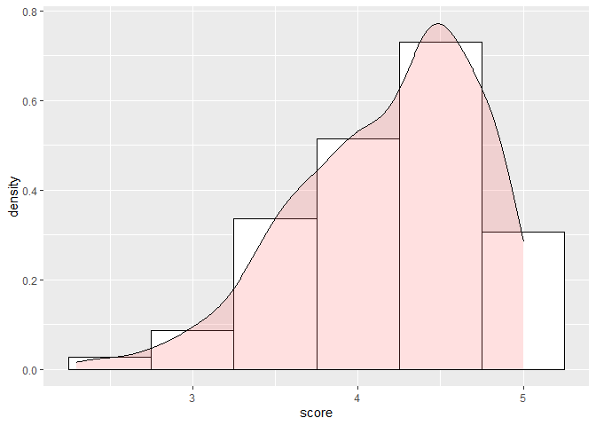
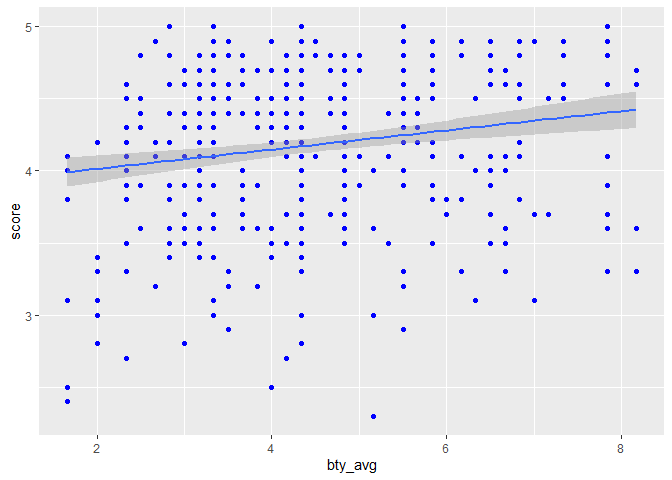
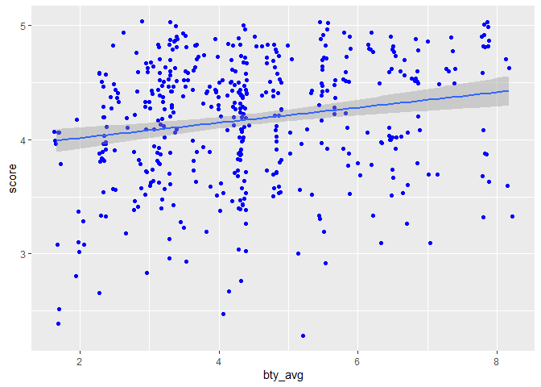
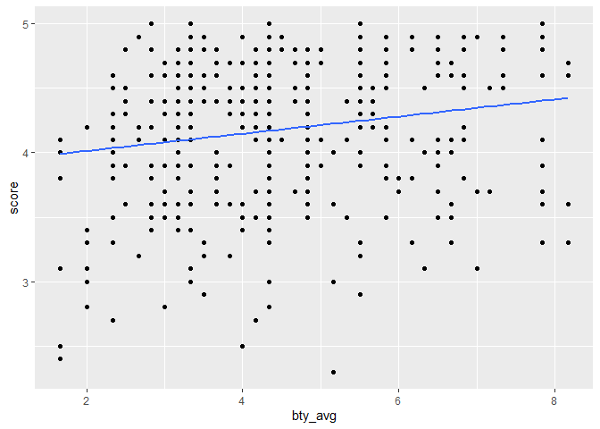

Lab 10 - Grading the professor, Pt. 2
================
Zheqi
3/6

### Load packages and data

``` r
library(tidyverse) 
library(tidymodels)
library(openintro)

library(broom)
library(openintro)
```

``` r
?evals
```

    ## starting httpd help server ... done

``` r
evals <- openintro::evals
```

### Exercise 1

``` r
ggplot(evals, aes(x=score)) + 
    geom_histogram(aes(y=..density..),      # Histogram with density instead of count on y-axis
                   binwidth=.5,
                   colour="black", fill="white") +
    geom_density(alpha=.2, fill="#FF6666")
```

    ## Warning: The dot-dot notation (`..density..`) was deprecated in ggplot2 3.4.0.
    ## ℹ Please use `after_stat(density)` instead.

<!-- -->

### Exercise 2

``` r
evals %>% 
  ggplot() + 
  aes(x = bty_avg, y = score) + 
  geom_point(color = 'blue') +
  geom_smooth(method = 'lm')
```

    ## `geom_smooth()` using formula = 'y ~ x'

<!-- -->

\#Exercise 3

``` r
evals %>% 
  ggplot() + 
  aes(x = bty_avg, y = score) + 
  geom_jitter(color = 'blue') +
  geom_smooth(method = 'lm')
```

    ## `geom_smooth()` using formula = 'y ~ x'

<!-- -->

``` r
#It adds a small amount of random variation to the location of each point, and is a useful way of handling overplotting caused by discreteness in smaller datasets.
```

\#Exercise 4

``` r
m_bty = lm(bty_avg ~ score, data = evals)
```

``` r
ggplot(evals,aes(bty_avg, score)) +
  geom_point() +
  geom_smooth(method='lm', se=FALSE) 
```

    ## `geom_smooth()` using formula = 'y ~ x'

<!-- -->

``` r
#higher scores are positively associated with better bty on average.
```

``` r
library(haven)
mbty <- lm(bty_avg ~ score, data = evals)
summary(mbty)
```

    ## 
    ## Call:
    ## lm(formula = bty_avg ~ score, data = evals)
    ## 
    ## Residuals:
    ##     Min      1Q  Median      3Q     Max 
    ## -2.7116 -1.2116 -0.2032  0.9328  4.2089 
    ## 
    ## Coefficients:
    ##             Estimate Std. Error t value Pr(>|t|)    
    ## (Intercept)   2.2237     0.5409   4.111 4.66e-05 ***
    ## score         0.5256     0.1285   4.090 5.08e-05 ***
    ## ---
    ## Signif. codes:  0 '***' 0.001 '**' 0.01 '*' 0.05 '.' 0.1 ' ' 1
    ## 
    ## Residual standard error: 1.502 on 461 degrees of freedom
    ## Multiple R-squared:  0.03502,    Adjusted R-squared:  0.03293 
    ## F-statistic: 16.73 on 1 and 461 DF,  p-value: 5.083e-05

``` r
#when average bty is less than 2, the score is 4. Does not make any sense.
```

``` r
#R-Square is .03502, every increase in bty_avg leads to an .52 increase in score. bty_avg significantly predicts the score.
```

``` r
m_gen <- lm(score ~ gender, data = evals)
summary(m_gen)
```

    ## 
    ## Call:
    ## lm(formula = score ~ gender, data = evals)
    ## 
    ## Residuals:
    ##      Min       1Q   Median       3Q      Max 
    ## -1.83433 -0.36357  0.06567  0.40718  0.90718 
    ## 
    ## Coefficients:
    ##             Estimate Std. Error t value Pr(>|t|)    
    ## (Intercept)  4.09282    0.03867 105.852  < 2e-16 ***
    ## gendermale   0.14151    0.05082   2.784  0.00558 ** 
    ## ---
    ## Signif. codes:  0 '***' 0.001 '**' 0.01 '*' 0.05 '.' 0.1 ' ' 1
    ## 
    ## Residual standard error: 0.5399 on 461 degrees of freedom
    ## Multiple R-squared:  0.01654,    Adjusted R-squared:  0.01441 
    ## F-statistic: 7.753 on 1 and 461 DF,  p-value: 0.005583

``` r
#the intercept does not have meanings. Males have .14 higher score than females.
```

``` r
# score=4.09282+.14151gendermale
#male=4.23433. female=4.09282
```

``` r
E <- evals %>%
  mutate(rank = relevel(rank, ref = "teaching"))
m_rank = lm(score ~ rank, data = E)
summary(m_rank)$coef
```

    ##                    Estimate Std. Error   t value      Pr(>|t|)
    ## (Intercept)       4.2843137 0.05365284 79.852504 1.021033e-271
    ## ranktenure track -0.1296841 0.07481531 -1.733390  8.369651e-02
    ## ranktenured      -0.1451833 0.06355455 -2.284389  2.280338e-02

``` r
#a little confused about the output. score=4.15462963 - .12961480 (tenure track) -.1451833(tenured)
```

``` r
S <- evals %>%
  mutate(rank = relevel(rank, ref = "tenure track"))
m_rank_relevel <- lm(score ~ rank, data = S)
summary(m_rank_relevel)$coef
```

    ##                 Estimate Std. Error    t value      Pr(>|t|)
    ## (Intercept)   4.15462963 0.05214119 79.6803772 2.577096e-271
    ## rankteaching  0.12968410 0.07481531  1.7333898  8.369651e-02
    ## ranktenured  -0.01549919 0.06228368 -0.2488484  8.035891e-01

``` r
#score=4.15462963 + .12961480 (teaching) -.01549919(tenured)
```

``` r
summary(m_rank_relevel)
```

    ## 
    ## Call:
    ## lm(formula = score ~ rank, data = S)
    ## 
    ## Residuals:
    ##     Min      1Q  Median      3Q     Max 
    ## -1.8546 -0.3391  0.1157  0.4305  0.8609 
    ## 
    ## Coefficients:
    ##              Estimate Std. Error t value Pr(>|t|)    
    ## (Intercept)   4.15463    0.05214  79.680   <2e-16 ***
    ## rankteaching  0.12968    0.07482   1.733   0.0837 .  
    ## ranktenured  -0.01550    0.06228  -0.249   0.8036    
    ## ---
    ## Signif. codes:  0 '***' 0.001 '**' 0.01 '*' 0.05 '.' 0.1 ' ' 1
    ## 
    ## Residual standard error: 0.5419 on 460 degrees of freedom
    ## Multiple R-squared:  0.01163,    Adjusted R-squared:  0.007332 
    ## F-statistic: 2.706 on 2 and 460 DF,  p-value: 0.06786

``` r
# R-squared=0.01163, non-significant
```

``` r
G<- evals %>%
  mutate(tenure_eligible = case_when(
                             rank == "teaching" ~ "No",
                             rank %in% c("tenure track", "tenured") ~ "Yes"))
```

``` r
m_tenure_eligible = lm( score ~ tenure_eligible, data = G)
summary(m_tenure_eligible)
```

    ## 
    ## Call:
    ## lm(formula = score ~ tenure_eligible, data = G)
    ## 
    ## Residuals:
    ##     Min      1Q  Median      3Q     Max 
    ## -1.8438 -0.3438  0.1157  0.4360  0.8562 
    ## 
    ## Coefficients:
    ##                    Estimate Std. Error t value Pr(>|t|)    
    ## (Intercept)          4.2843     0.0536  79.934   <2e-16 ***
    ## tenure_eligibleYes  -0.1406     0.0607  -2.315    0.021 *  
    ## ---
    ## Signif. codes:  0 '***' 0.001 '**' 0.01 '*' 0.05 '.' 0.1 ' ' 1
    ## 
    ## Residual standard error: 0.5413 on 461 degrees of freedom
    ## Multiple R-squared:  0.0115, Adjusted R-squared:  0.009352 
    ## F-statistic: 5.361 on 1 and 461 DF,  p-value: 0.02103

``` r
#score=4.2843-.1406 tenure_eligible(yes)
#tenure eligible have .1406 lower scores comparatively to the teaching professors.
#r-square is ,0115. significant.
```
